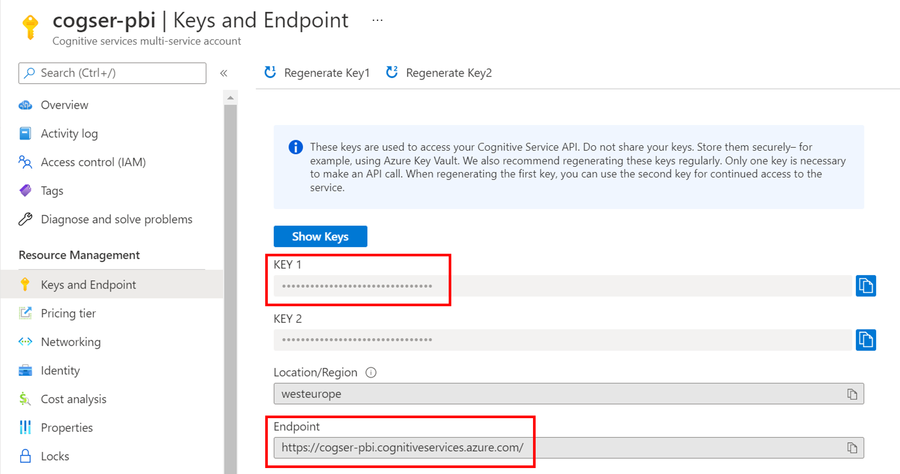
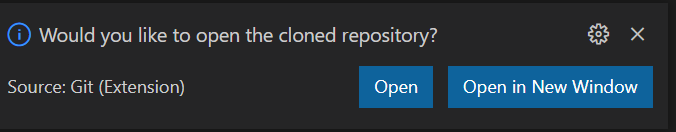
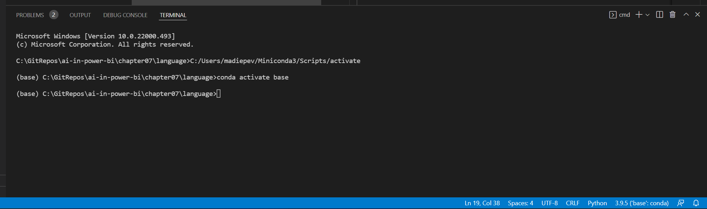

# Instructions to run Python scripts locally
To showcase the use of the Cognitive Services, the book uses Python scripts as examples. If you want to run the Python scripts locally, you'll need to install Python and use an IDE. In these instructions, it is described how Visual Studio Code can be used to easily navigate between scripts and edit them to add the endpoint and subscription key to your own Cognitive Services resource.

## Prerequisites

You need to have a Cognitive Services resource created with an Azure subscription. The instructions to create a Cognitive Services resource are described in Chapter 7. 

1. Navigate to the created resource and copy the **endpoint** and one of the **keys** from the **Keys and Endpoint** tab:



2. Save the endpoint and key for later (in a Notepad file for example). Be careful when pasting it somewhere, that the first letter of the key is not capitalized.

## Set up Visual Studio Code

1. Download and install [Visual Studio Code](https://code.visualstudio.com/).
2. Once installed, launch Visual Studio Code. 
3. Go to the **Extensions** tab.
4. Search and install the **Python** extension.

### Set up Python

1. Download and install the latest Python version (and other necessary libraries) by using the installer [Miniconda](https://docs.conda.io/en/latest/miniconda.html)
2. Once Miniconda is installed, search for the new application Anaconda prompt (Miniconda) and open it.
3. Enter the following code in the Anaconda prompt to install any necessary packages:

```
pip install azure-ai-textanalytics==5.1.0
pip install --upgrade azure-cognitiveservices-vision-computervision
pip install pillow
```

### Git

1. Download and install [Git](https://git-scm.com/download.html) to be able to copy this repository with the scripts and data.

### Copy the GitHub repository to your local system

1. Within Visual Studio Code, select **CTRL+SHIFT+P** to open the **Command Palette**. 
2. Search and select **Git:Clone**.
**Don't** select Clone from GitHub, for which you need to sign in with a GitHub account. 
3. Instead, paste the URL: https://github.com/PacktPublishing/Artificial-Intelligence-with-Power-BI.git
4. Select a local folder to which all files of the repository will be copied. 
5. Once the repository is cloned, a notification in the bottom right of Visual Studio Code will ask you whether you want to open the cloned repo. Select **Open**.



## Analyze text

1. Open the Python script located at **Chapter07/language/analyze-text.py**.
2. Replace <your-subscription-key> with the key you copied earlier.
3. Replace <your-cognitive-service> with the name of the Cognitive Services resource you created. Or replace the complete value of the endpoint with your endpoint.
4. Save the changes you made to the **analyze-text.py** script.
5. Right-click the **language** folder and select **Open in Integrated terminal**. A terminal appears at the bottom of your screen:



6. In the terminal, run the following code:

```
python analyze-text.py
```

Once the script has run successfully, you should see the result in the terminal too. Refer back to the book for an explanation on the results.

> Note: The script uses the text files in the **reviews** folder as input. If you want to test the service with other text, save the text files in the reviews folder (or create a new parallel folder with the text files and update the path in the script). Run the script again to see the results.

## Describe images

1. Open the Python script located at **Chapter07/vision/describe-image.py**.
2. Replace <your-subscription-key> with the key you copied earlier.
3. Replace <your-cognitive-service> with the name of the Cognitive Services resource you created. Or replace the complete value of the endpoint with your endpoint.
4. Save the changes you made to the **describe-image.py** script.
5. Right-click the **vision** folder and select **Open in Integrated terminal**. A terminal appears at the bottom of your screen.
6. In the terminal, run the following code:

```
python describe-image.py
```

Once the script has run successfully, you should see the result in the terminal too. Refer back to the book for an explanation on the results.

> Note: The script uses the **images/street.jpeg** file as input. If you want to test the service with another image, save the image in the images folder and update the path in the script. Save the script and run it again to see the results.

## Detect objects in images

1. Open the Python script located at **Chapter07/vision/detect-objects.py**.
2. Replace <your-subscription-key> with the key you copied earlier.
3. Replace <your-cognitive-service> with the name of the Cognitive Services resource you created. Or replace the complete value of the endpoint with your endpoint.
4. Save the changes you made to the **detect-objects.py** script.
5. Right-click the **vision** folder and select **Open in Integrated terminal**. A terminal appears at the bottom of your screen.
6. In the terminal, run the following code:

```
python detect-objects.py
```

Once the script has run successfully, you should see the result in the terminal too. Refer back to the book for an explanation on the results.

> Note: The script uses the **images/objects.jpeg** file as input. If you want to test the service with another image, save the image in the images folder and update the path in the script. Save the script and run it again to see the results.